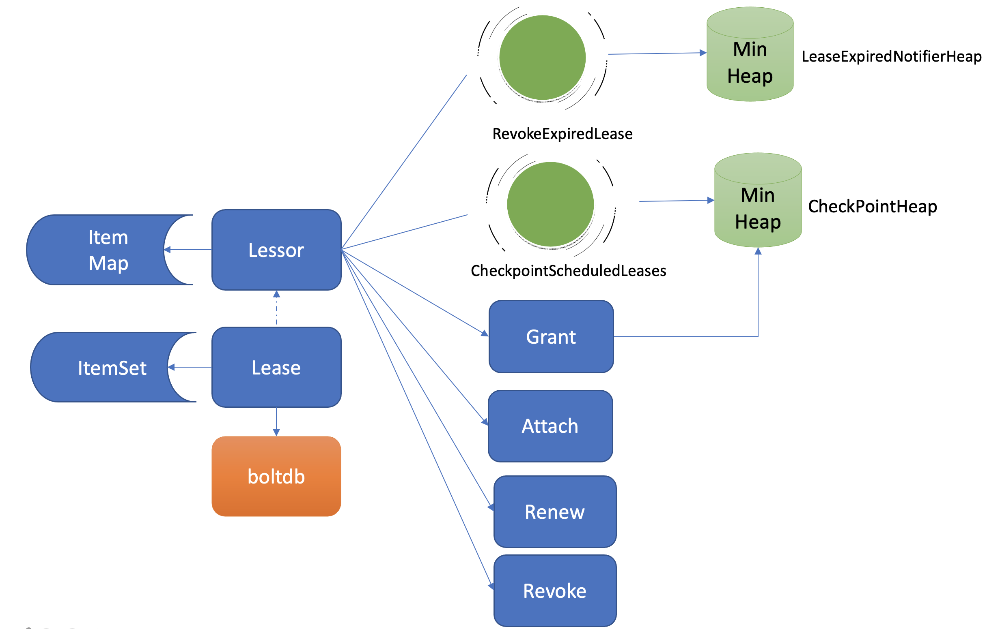
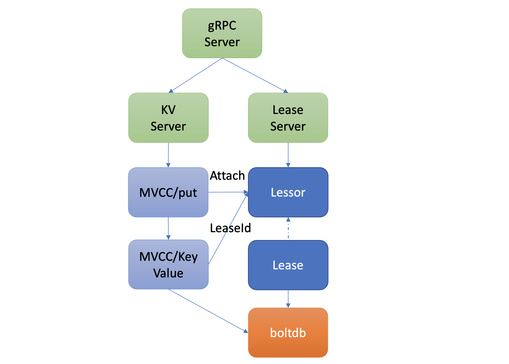

# 租约

聊聊 Leader 选举背后技术点之一的 Lease， 解析它的核心原理、性能优化思路，希望通过本节让你对 Lease 如何关联 key、Lease 如何高效续期、淘汰、什么是 checkpoint 机制有深入的理解。同时希望你能基于 Lease 的 TTL 特性，解决实际业务中遇到分布式锁、节点故障自动剔除等各类问题，提高业务服务的可用性。

### 什么是 Lease

Leader 选举本质是要解决什么问题?、

首先当然是要保证 Leader 的唯一性，确保集群不出现多个 Leader，才能保证业务逻辑准确性，也就是安全性（Safety）、互斥性。

其次是主节点故障后，备节点应可快速感知到其异常，也就是活性（liveness）检测。实现活性检测主要有两种方案。

方案一为被动型检测，你可以通过探测节点定时拨测 Leader 节点，看是否健康，比如 Redis Sentinel。

方案二为主动型上报，Leader 节点可定期向协调服务发送"特殊心跳"汇报健康状态，若其未正常发送心跳，并超过和协调服务约定的最大存活时间后，就会被协调服务移除 Leader 身份标识。同时其他节点可通过协调服务，快速感知到 Leader 故障了，进而发起新的选举。

Lease，正是基于主动型上报模式，提供的一种活性检测机制。

你可以基于 Lease 的 TTL 特性，解决类似 Leader 选举、Kubernetes Event 自动淘汰、服务发现场景中故障节点自动剔除等问题。

### Lease 整体架构



etcd 在启动的时候，创建 Lessor 模块的时候，它会启动两个常驻 goroutine，一个是 RevokeExpiredLease 任务，定时检查是否有过期 Lease，发起撤销过期的 Lease 操作。一个是 CheckpointScheduledLease，定时触发更新 Lease 的剩余到期时间的操作。

Lessor 模块提供了 Grant、Revoke、LeaseTimeToLive、LeaseKeepAlive API 给 client 使用，各接口作用如下:

- Grant 表示创建一个 TTL 为你指定秒数的 Lease，Lessor 会将 Lease 信息持久化存储在 boltdb 中；
- Revoke 表示撤销 Lease 并删除其关联的数据；
- LeaseTimeToLive 表示获取一个 Lease 的有效期、剩余时间；
- LeaseKeepAlive 表示为 Lease 续期。

### key 如何关联 Lease

首先 Lessor 的 Grant 接口会把 Lease 保存到内存的 ItemMap 数据结构中，然后它需要持久化 Lease，将 Lease 数据保存到 boltdb 的 Lease bucket 中，返回一个唯一的 LeaseID 给 client。

KV 模块的 API 接口提供了一个"--lease"参数，你可以通过如下命令，将 key node 关联到对应的 LeaseID 上。然后你查询的时候增加 -w 参数输出格式为 json，就可查看到 key 关联的 LeaseID。

```shell

$ etcdctl put node healthy --lease 326975935f48f818
OK
$ etcdctl get node -w=json | python -m json.tool
{
    "kvs":[
        {
            "create_revision":24，
            "key":"bm9kZQ=="，
            "Lease":3632563850270275608，
            "mod_revision":24，
            "value":"aGVhbHRoeQ=="，
            "version":1
        }
    ]
}
```

以上流程描述了用户的 key 是如何与指定 Lease 关联的。当你通过 put 等命令新增一个指定了"--lease"的 key 时，MVCC 模块它会通过 Lessor 模块的 Attach 方法，将 key 关联到 Lease 的 key 内存集合 ItemSet 中。





一个 Lease 关联的 key 集合是保存在内存中的，那么 etcd 重启时，是如何知道每个 Lease 上关联了哪些 key 呢?

答案是 etcd 的 MVCC 模块在持久化存储 key-value 的时候，保存到 boltdb 的 value 是个结构体（mvccpb.KeyValue）， 它不仅包含你的 key-value 数据，还包含了关联的 LeaseID 等信息。因此当 etcd 重启时，可根据此信息，重建关联各个 Lease 的 key 集合列表。

### 如何优化 Lease 续期性能

Lease 续期其实很简单，核心是将 Lease 的过期时间更新为当前系统时间加其 TTL。关键问题在于续期的性能能否满足业务诉求。

影响续期性能因素又是源自多方面的。首先是 TTL，TTL 过长会导致节点异常后，无法及时从 etcd 中删除，影响服务可用性，而过短，则要求 client 频繁发送续期请求。其次是 Lease 数，如果 Lease 成千上万个，那么 etcd 可能无法支撑如此大规模的 Lease 数，导致高负载。

etcd v2 版本是如何实现 TTL 特性的。在早期 v2 版本中，没有 Lease 概念，TTL 属性是在 key 上面，为了保证 key 不删除，即便你的 TTL 相同，client 也需要为每个 TTL、key 创建一个 HTTP/1.x 连接，定时发送续期请求给 etcd server。

v2 老版本这种设计，因不支持连接多路复用、相同 TTL 无法复用导致性能较差，无法支撑较大规模的 Lease 场景。

etcd v3 版本为了解决以上问题，提出了 Lease 特性，TTL 属性转移到了 Lease 上， 同时协议从 HTTP/1.x 优化成 gRPC 协议。

一方面不同 key 若 TTL 相同，可复用同一个 Lease， 显著减少了 Lease 数。另一方面，通过 gRPC HTTP/2 实现了多路复用，流式传输，同一连接可支持为多个 Lease 续期，大大减少了连接数。

通过以上两个优化，实现 Lease 性能大幅提升，满足了各个业务场景诉求。

### 如何高效淘汰过期 Lease

目前 etcd 是基于最小堆来管理 Lease，实现快速淘汰过期的 Lease。

etcd 早期的时候，淘汰 Lease 非常暴力。etcd 会直接遍历所有 Lease，逐个检查 Lease 是否过期，过期则从 Lease 关联的 key 集合中，取出 key 列表，删除它们，时间复杂度是 O(N)。

etcd Lease 高效淘汰方案最小堆的实现方法。每次只需轮询、检查排在前面的 Lease 过期时间，一旦轮询到未过期的 Lease， 则可结束本轮检查。

etcd Lessor 主循环每隔 500ms 执行一次撤销 Lease 检查（RevokeExpiredLease），每次轮询堆顶的元素，若已过期则加入到待淘汰列表，直到堆顶的 Lease 过期时间大于当前，则结束本轮轮询。

相比早期 O(N) 的遍历时间复杂度，使用堆后，插入、更新、删除，它的时间复杂度是 O(Log N)，查询堆顶对象是否过期时间复杂度仅为 O(1)，性能大大提升，可支撑大规模场景下 Lease 的高效淘汰。

获取到待过期的 LeaseID 后，Leader 是如何通知其他 Follower 节点淘汰它们呢？

Lessor 模块会将已确认过期的 LeaseID，保存在一个名为 expiredC 的 channel 中，而 etcd server 的主循环会定期从 channel 中获取 LeaseID，发起 revoke 请求，通过 Raft Log 传递给 Follower 节点。

各个节点收到 revoke Lease 请求后，获取关联到此 Lease 上的 key 列表，从 boltdb 中删除 key，从 Lessor 的 Lease map 内存中删除此 Lease 对象，最后还需要从 boltdb 的 Lease bucket 中删除这个 Lease。

**以上就是 Lease 的过期自动淘汰逻辑。Leader 节点按过期时间维护了一个最小堆，若你的节点异常未正常续期，那么随着时间消逝，对应的 Lease 则会过期，Lessor 主循环定时轮询过期的 Lease。获取到 ID 后，Leader 发起 revoke 操作，通知整个集群删除 Lease 和关联的数据。**

### checkpoint 机制

当你的集群发生 Leader 切换后，新的 Leader 基于 Lease map 信息，按 Lease 过期时间构建一个最小堆时，etcd 早期版本为了优化性能，并未持久化存储 Lease 剩余 TTL 信息，因此重建的时候就会自动给所有 Lease 自动续期了。

然而若较频繁出现 Leader 切换，切换时间小于 Lease 的 TTL，这会导致 Lease 永远无法删除，大量 key 堆积，db 大小超过配额等异常。

为了解决这个问题，etcd 引入了检查点机制

一方面，etcd 启动的时候，Leader 节点后台会运行此异步任务，定期批量地将 Lease 剩余的 TTL 基于 Raft Log 同步给 Follower 节点，Follower 节点收到 CheckPoint 请求后，更新内存数据结构 LeaseMap 的剩余 TTL 信息。

另一方面，当 Leader 节点收到 KeepAlive 请求的时候，它也会通过 checkpoint 机制把此 Lease 的剩余 TTL 重置，并同步给 Follower 节点，尽量确保续期后集群各个节点的 Lease 剩余 TTL 一致性。

### 小结

Lease 的核心是 TTL，当 Lease 的 TTL 过期时，它会自动删除其关联的 key-value 数据。

首先是 Lease 创建及续期。当你创建 Lease 时，etcd 会保存 Lease 信息到 boltdb 的 Lease bucket 中。为了防止 Lease 被淘汰，你需要定期发送 LeaseKeepAlive 请求给 etcd server 续期 Lease，本质是更新 Lease 的到期时间。

续期的核心挑战是性能，etcd 经历了从 TTL 属性在 key 上，到独立抽象出 Lease，支持多 key 复用相同 TTL，同时协议从 HTTP/1.x 优化成 gRPC 协议，支持多路连接复用，显著降低了 server 连接数等资源开销。

其次是 Lease 的淘汰机制，etcd 的 Lease 淘汰算法经历了从时间复杂度 O(N) 到 O(Log N) 的演进，核心是轮询最小堆的 Lease 是否过期，若过期生成 revoke 请求，它会清理 Lease 和其关联的数据。

最后介绍了 Lease 的 checkpoint 机制，它是为了解决 Leader 异常情况下 TTL 自动被续期，可能导致 Lease 永不淘汰的问题而诞生。